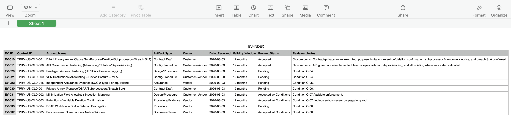
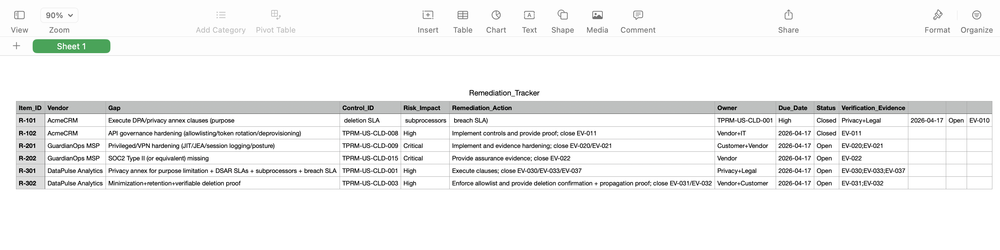
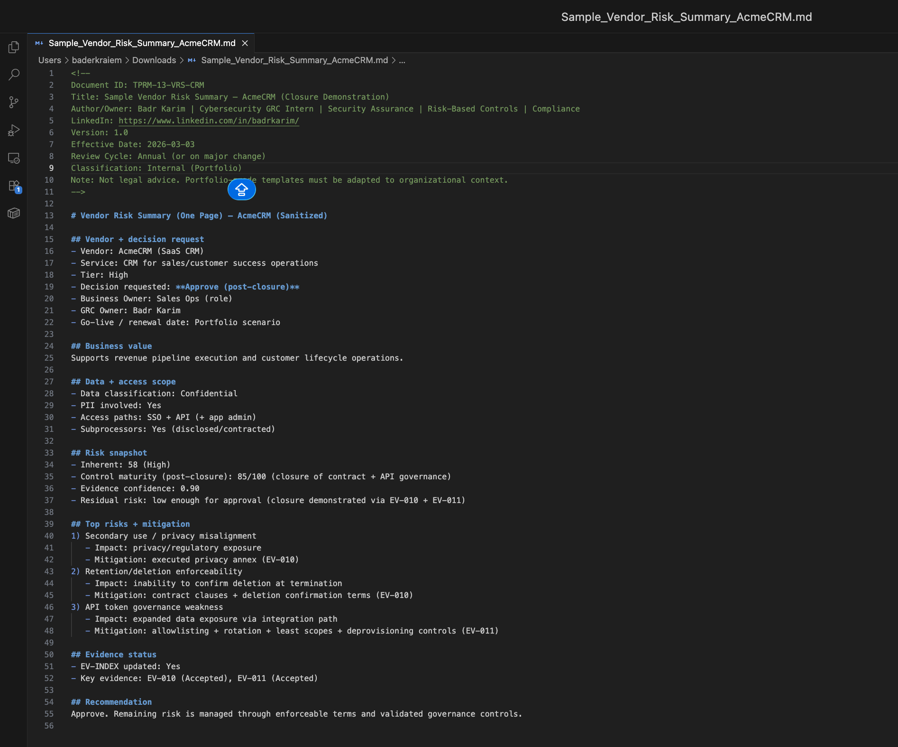

# TPRM — US Privacy + Cloud Data Protection (Audit-Ready Program Portfolio)
**Author/Owner:** Badr Karim — Cybersecurity GRC Intern | Security Assurance | Risk-Based Controls | Privacy-Driven TPRM 
LinkedIn: https://www.linkedin.com/in/badrkarim/

This repository is my **personal TPRM program portfolio** written in a **US workplace assurance style**:
tiering, defensible scoring, required controls by risk, and **audit-ready evidence discipline**.

**Focus:** US privacy expectations + cloud vendor data protection.  
> Not legal advice. Examples are **sanitized** to demonstrate process quality, traceability, and evidence discipline.

---

## Start Here (Fast Reviewer Path)
1) `00_Start-Here/Portfolio_Authenticity_Statement.md`
2) `00_Start-Here/Executive_Summary.md`
3) `00_Start-Here/Reviewer_Guide.md`
4) Policy/Standard/SOP: `01_Policy-and-Program/`
5) Risk models: `03_Risk-Scoring/`
6) Tiered DDQ: `04_Due-Diligence/`
7) Controls + mapping: `05_Control-Library-and-Mapping/`
8) Evidence system: `06_Evidence/`
9) Decision + remediation: `07_Decision-Remediation/`
10) Contracts + monitoring/offboarding: `08_Contracts/` and `09_Monitoring-Offboarding/`
11) Business decision artifacts: `13_Business-Decision-Pack/`

---

## Sample Vendor Packages (Sanitized, End-to-End)
These demonstrate real execution: intake → DDQ → evidence → residual risk → decision → remediation.

1) **High-tier SaaS CRM (SSO + API)**  
   Files: `Intake_AcmeCRM.md`, `DDQ_AcmeCRM.md`, `ResidualRisk_AcmeCRM.md`, `Decision_AcmeCRM.md`

2) **Critical-tier MSP (VPN + Privileged Admin Access)**  
   Files: `Intake_GuardianOpsMSP.md`, `DDQ_GuardianOpsMSP.md`, `ResidualRisk_GuardianOpsMSP.md`, `Decision_GuardianOpsMSP.md`

3) **High-tier Data Analytics (Large-scale PII)** — **privacy-heavy**  
   Files: `Intake_DataPulse.md`, `DDQ_DataPulse.md`, `RoPA_DataPulse.md`, `DSAR_DataPulse.md`, `ResidualRisk_DataPulse.md`, `Decision_DataPulse.md`

---

## Governance, Privacy Ops, Monitoring, Audit Readiness (US-grade)
- Governance: `14_Governance/`
- Privacy Operations: `15_Privacy-Ops/`
- Monitoring: `16_Monitoring/`
- Assessment Reporting: `17_Assessment-Reporting/`
- Audit Readiness: `18_Audit-Readiness/`

---

## Visual Proof (Sanitized)
**EV-INDEX (Evidence Register):**  

**Remediation Tracker (Closed Items):**  

**One-Page Vendor Risk Summary:**  

